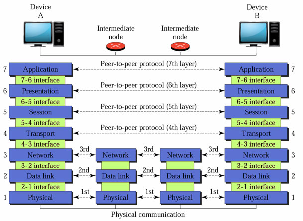
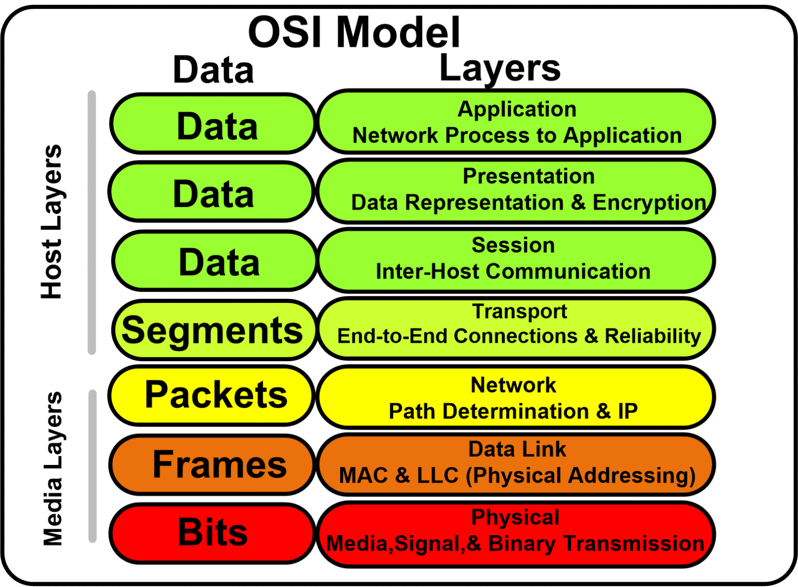

# **OSI model layer**
## **Abstract**
---

 ISO was one of the first oraganisations to formally define a good way to connect comoputers. OSI was introduced in 1983 by representatives of the major computer and telecom companies, and was adopted by ISO ( International Standard Organisation ) as an international standard in 1984. it is a widely used model for networking. The modern Internet is not based on OSI, but on the simpler TCP/IP model. However, the OSI 7-layer model is still widely used, as it helps visualize and communicate how networks operate, and helps isolate and troubleshoot networking problems. 

## **Introduction**
---
OSI model is a layered server architecture system in which each layer is defined according to a specific function to perform. All these seven layers work to transmit the data from one computer to another.

### **Architecture of OSI model**
---

There are 7 layers in this model, which helps in a safe and succesful transmisssion of data.

1. Physical Layer
2. Data link Layer
3. Network Layer
4. Transport Layer
5. Session Layer 
6. Presentation Layer
7. Application Layer   

 The lower layers ( Physical, Data link layer, Network ) deal with electrical signals, chunks of binary data, and routing of these data across networks. Higher levels ( Transport, Session, Presentation, Application ) cover network requests and responses, representation of data, and network protocols, as seen from a user's point of view.  

## **Physical layer**

 Physical layer is the lowest layer of OSI model and it is responsible for the physical cable or wireless connection between network nodes. It defines the connector ( laser cable ), the electrical cable or wireless technology connecting the devices.it also deals with the functions and procedures require for the transmission.it takes care of 

* **Physical charactoristics of interfaces**
* **Representation of bits**
* **Data rate**
* **Synchronization of bits**

## **Data link layer**

Data link layer is above the physical layer and it is responsible for the transmission of frames from one node to another.This layer is composed of two parts—Logical Link Control (LLC), which identifies network protocols, performs error checking and synchronizes frames, and Media Access Control (MAC) which uses MAC addresses to connect devices and define permissions to transmit and receive data.

## **Network layer** 

 This layer is responsible for delivery of packets from source to destination. The network layer works for the transmission of data from one host to the other located in different networks. It also takes care of packet routing.

This layer performs 2 task below:

* **Routing**

The network layer protocols determine which route is suitable from source to destination.

* **Logical Addressing**

 In order to identify each device on internetwork uniquely, the network layer defines an addressing scheme. The sender & receiver’s IP addresses are placed in the header by the network layer. Such an address distinguishes each device uniquely.

## **Transport layer**

 The transport layer provides services to the application layer and takes services from the network layer. The data in the transport layer is referred to as Segments. It is responsible for the End to End Delivery of the complete message. The transport layer also provides the acknowledgement of the successful data transmission and re-transmits the data if an error is found. 

* **Sender side**

 Transport layer receives the formatted data from the upper layers, performs Segmentation, and also implements Flow & Error control to ensure proper data transmission. It also adds Source and Destination port numbers in its header and forwards the segmented data to the Network Layer. 

* **Reciever side**

 Transport Layer reads the port number from its header and forwards the Data which it has received to the respective application. It also performs sequencing and reassembling of the segmented data. 

The functions of the transport layer are :

* **Segmentation and Resembling**

 This layer accepts the message from the (session) layer, breaks the message into smaller units. Each of the segments produced has a header associated with it. The transport layer at the destination station reassembles the message.

* **Service Point Addressing**

in order to deliver the message to the correct process, the transport layer header includes a type of address called service point address or port address. Thus by specifying this address, the transport layer makes sure that the message is delivered to the correct process.

## **Session layer**

This layer is responsible for the establishment of connection, maintenance of sessions, authentication, and also ensures security. 

* **Session establishment, maintenance, and termination**

The layer allows the two processes to establish, use and terminate a connection.

* **Synchronization**

This layer allows a process to add checkpoints which are considered synchronization points into the data. These synchronization points help to identify the error so that the data is re-synchronized properly, and ends of the messages are not cut prematurely and data loss is avoided.

* **Dialog Controller**

The session layer allows two systems to start communication with each other in half-duplex or full-duplex.

## **Presentation layer**

he presentation layer is also called the Translation layer. The data from the application layer is extracted here and manipulated as per the required format to transmit over the network. 

The functions of the presentation layer are :

* **Translation** 

For example, ASCII to EBCDIC.

* **Encryption/Decryption**

Data encryption translates the data into another form or code. The encrypted data is known as the ciphertext and the decrypted data is known as plain text. A key value is used for encrypting as well as decrypting data.

* **Compression**

Reduces the number of bits that need to be transmitted on the network.

## **Application Layer**

The application layer is used by end-user software such as web browsers and email clients. It provides protocols that allow software to send and receive information and present meaningful data to users. A few examples of application layer protocols are the Hypertext Transfer Protocol (HTTP), File Transfer Protocol (FTP), Post Office Protocol (POP), Simple Mail Transfer Protocol (SMTP), and Domain Name System (DNS).
Some example software are:

Browsers, Skype Messenger, etc.

### **OSI Data Transfer Mechanism**
When two systems A and B that use the OSI reference model communicate with each other, the data transfer process is shown below:
1.  When the data of the application process of system A is transmitted to the application layer, the data of the application layer is combined with the control header of this layer to form the data service unit of the application layer, and then transmitted to the presentation layer.
2. After the presentation layer receives the data unit, it will add the control header of this layer to form the data service unit of the presentation layer and transmit it to the session layer. By analogy, the data is transferred to the transport layer.
3. When the transport layer receives this data unit, the control header of this layer is added to form the transport layer service data unit.
4. When the newspapers of the transmission layer are sent to the network layer, because the length of the network data unit is limited, the long messages of the transmission layer will be divided into several shorter data fields, plus the control header of the network layer, forming the data service unit of the network layer.
5. When the grouping of the network layer is transmitted to the data link layer, add the control information of the data link layer, and the data service unit of the data link layer becomes the domain.
6. After the frames of the data link layer are transmitted to the physical layer, the physical layer will be transmitted through the transmission medium in the form of bit flow.When the bitstream reaches the target node system B, it is uploaded from the physical layer. After each layer processes the control header of its own layer, the user data is submitted to the upper layer, and finally the application data of system A is transmitted to the application of system B.

## **Summary**
---
Although the system data in the OSI environment through A complex process can be sent to another system B, but for each computer application process of this process is transparent, A process of the application of the data seems to be directly transmitted to the process of application of B this is the nature of open system in the process of network communication.

## **Reference**
---

1. Google Scholars
   
1. Layers detailed explaination on https://www.lifewire.com/layers-of-the-osi-model-illustrated-818017

1. Explanation found on
 https://www.geeksforgeeks.org/layers-of-osi-model/

1. The discussion about Mechanism of  Data transmission and OSI model by Piyush saxena
